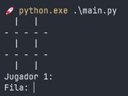
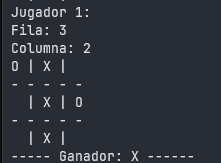

# TIC TAC TOE

# How to play:

1. Run the program
    ```bash
    python main.py
    ```

2. Follow the instructions
   . Insert the row number (1-3)
   . Insert the column number (1-3)

3. Enjoy

## Example:



First player 1 (X), the program asks for the row and column number. Then it asks for the row and column number of the second player (O).

## Example winner:

